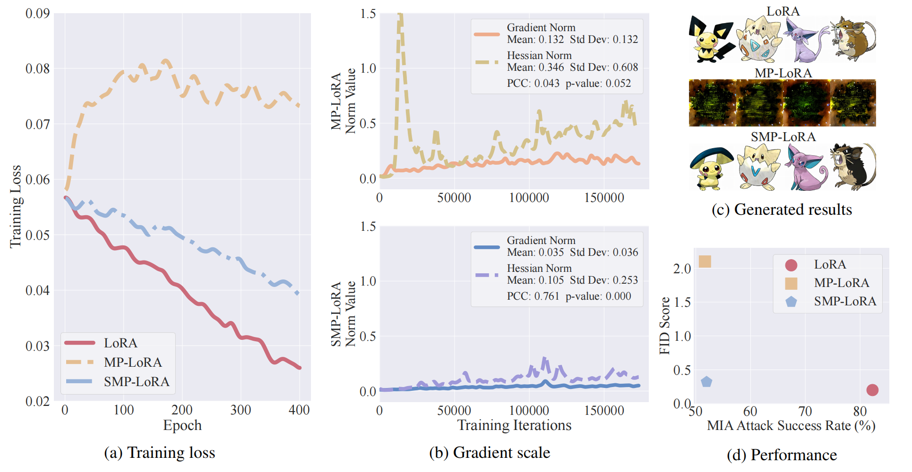
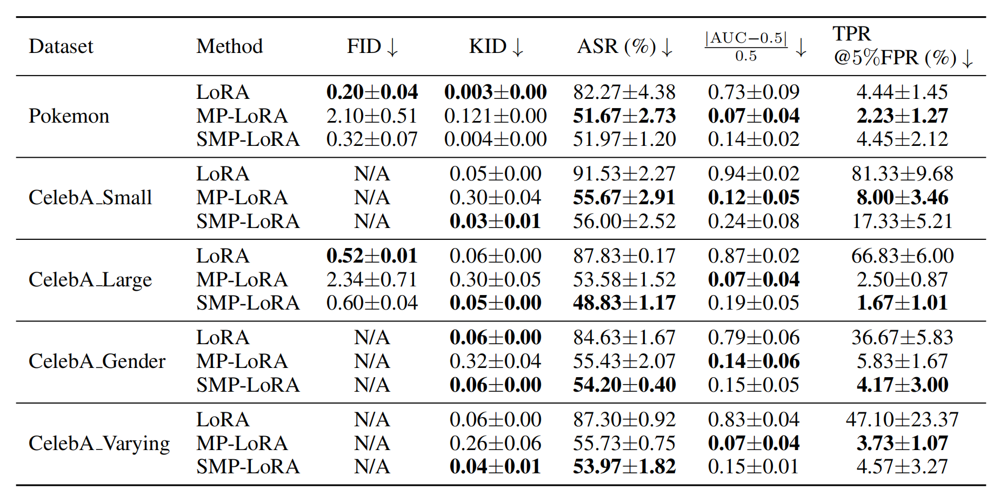
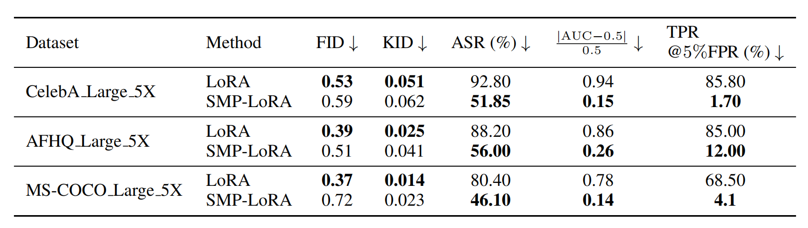

# [AAAI 2025] Privacy-Preserving Low-Rank Adaptation Against Membership Inference Attacks for Latent Diffusion Models

This repository is an official implementation of the paper "Privacy-Preserving Low-Rank Adaptation Against Membership Inference Attacks for Latent Diffusion Models", AAAI, 2025.

[](https://arxiv.org/abs/2402.11989)
[](https://medium.com/@williamlzh00/aaai-2025-privacy-preserving-lora-protecting-diffusion-models-against-membership-inference-f92a97ec5fae)
[](https://www.youtube.com/watch?v=97f7F4aq3pU)
[](https://zhuanlan.zhihu.com/p/30913359360)
[](https://www.bilibili.com/video/BV1WBoWYsEJA/?share_source=copy_web&vd_source=37ea6e52d5a923af1e67883c0cfbde0c)

By [Zihao Luo](https://profiles.auckland.ac.nz/zluo784), [Xilie Xu](https://godxuxilie.github.io/), [Feng Liu](https://fengliu90.github.io/index.html), [Yun Sing Koh](https://profiles.auckland.ac.nz/y-koh), [Di Wang](https://shao3wangdi.github.io/), [Jingfeng Zhang](https://zjfheart.github.io/)

> **Abstract:** Low-rank adaptation (LoRA) is an efficient strategy for adapting latent diffusion models (LDMs) on a private dataset to generate specific images by minimizing the adaptation loss. However, the LoRA-adapted LDMs are vulnerable to membership inference (MI) attacks that can judge whether a particular data point belongs to the private dataset, thus leading to the privacy leakage. To defend against MI attacks, we first propose a straightforward solution: Membership-Privacy-preserving LoRA (MP-LoRA). MP-LoRA is formulated as a min-max optimization problem where a proxy attack model is trained by maximizing its MI gain while the LDM is adapted by minimizing the sum of the adaptation loss and the MI gain of the proxy attack model. However, we empirically find that MP-LoRA has the issue of unstable optimization, and theoretically analyze that the potential reason is the unconstrained local smoothness, which impedes the privacy-preserving adaptation. To mitigate this issue, we further propose a Stable Membership-Privacy-preserving LoRA (SMP-LoRA) that adapts the LDM by minimizing the ratio of the adaptation loss to the MI gain. Besides, we theoretically prove that the local smoothness of SMP-LoRA can be constrained by the gradient norm, leading to improved convergence. Our experimental results corroborate that SMP-LoRA can indeed defend against MI attacks and generate high-quality images.
> 
>  
> <br/>


## Training

Move py file to ./sd-scripts and Run sh file

MP-LoRA: ```MP-LoRA-Pokemon.py```, ```MP-LoRA-CelebA.py```

SMP-LoRA: ```SMP-LoRA-Pokemon.py```, ```SMP-LoRA-CelebA.py```

## Dataset: 
[Pokemon Dataset](https://huggingface.co/datasets/lambdalabs/pokemon-blip-captions), [CelebA Dataset](https://mmlab.ie.cuhk.edu.hk/projects/CelebA.html).

## Results
- Performance of LoRA, MP-LoRA, and SMP-LoRA across five datasets, as measured by FID, KID, ASR, AUC, and
TPR at 5% FPR.



- Performance of LoRA and SMP-LoRA across three larger datasets, as measured by FID, KID, AUC, and TPR.



## Acknowledgements
This code is built on [sd-scripts](https://github.com/kohya-ss/sd-scripts).

## Citation

```
@inproceedings{luo2025privacy,
  title={Privacy-Preserving Low-Rank Adaptation Against Membership Inference Attacks for Latent Diffusion Models},
  author={Luo, Zihao and Xu, Xilie and Liu, Feng and Koh, Yun Sing and Wang, Di and Zhang, Jingfeng},
  booktitle={Proceedings of the AAAI Conference on Artificial Intelligence},
  volume={39},
  number={6},
  pages={5883--5891},
  year={2025}
}
```